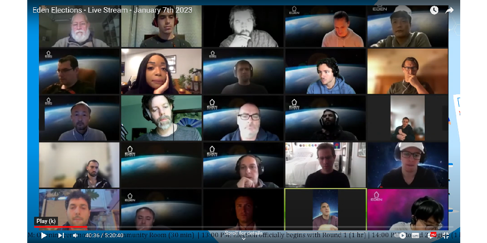

# Community Room

The Community Room is a space where Eden Members can gather during an Eden Election to socialize and engage in the election process. This room provides an opportunity for members to connect with one another, ask questions, and enjoy a relaxed atmosphere while participating in the election.

<figure><figcaption></figcaption></figure>

The Community Room is typically broadcasted live on platforms such as [YouTube ](https://www.youtube.com/watch?v=pVK2PvrVSwM). The link to access the room will be shared in the Eden Community Group on Telegram in accordance with the election schedule.
