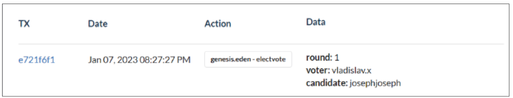

# Voting

**Every vote by Eden Members are registered on-chain, in the EOS blockchain. The UI provides an easy method to vote, hiding away the smart contract interaction in the backend. The website makes it easy to vote, but if it's not working, you can still vote using the Smart Contract directly.**

<figure><figcaption>
From genesis.eden contract
</figcaption></figure>


**In an Eden Election, the person with greater than 2/3 of the vote should also vote for themselves in order to get elected.**


