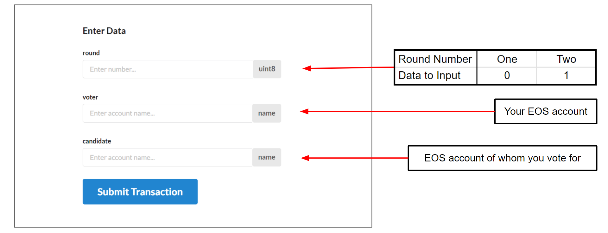

# 〽 Voting using Contract

In the case of the Election Portal facing a downtime we can directly interact with the genesis.eden smart contract to cast our votes.

If you are unfamiliar with accessing EOS Smart Contracts use this guide :&#x20;



1. Go to the `electvote` action in `genesis.eden` contract. Use the following direct link to reach there faster : \
   \
   [https://bloks.io/account/genesis.eden?account=genesis.eden\&action=electvote\&limit=100\&loadContract=true\&scope=genesis.eden\&tab=Actions](https://bloks.io/account/genesis.eden?account=genesis.eden\&action=electvote\&limit=100\&loadContract=true\&scope=genesis.eden\&tab=Actions)\

2. Enter the appropriate data and initiate the transaction.

<figure><figcaption></figcaption></figure>


If you are voting for yourself, Enter your EOS account in the candidate field. The round data needs to be "0" for Round One and _**NOT**_ "1".



The **UpVote bot** will send a pre-filled link that will make this method easier during the election so that you only have to enter whom you vote for , skipping other data.


