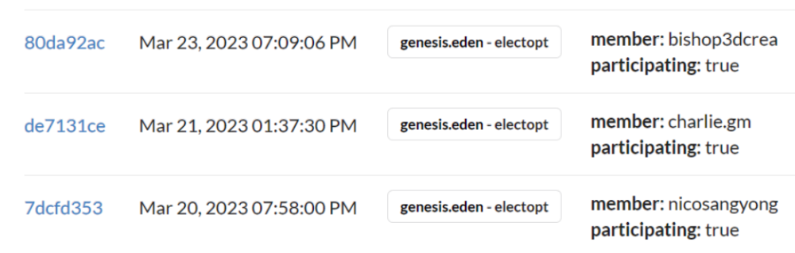

# Registering using Contract

1. Navigate to the `electopt` action on `genesis.eden` contract using the below link : \
   \
   [https://bloks.io/account/genesis.eden?account=genesis.eden\&action=electopt\&limit=100\&loadContract=true\&scope=genesis.eden\&tab=Actions](https://bloks.io/account/genesis.eden?account=genesis.eden\&action=electopt\&limit=100\&loadContract=true\&scope=genesis.eden\&tab=Actions)\

2. Login to the Block Explorer. Follow this guide :&#x20;



3. Enter your Eden linked EOS account  and toggle the participating switch to `true` ( or 1 ).

<figure><figcaption></figcaption></figure>

4. Submit the transaction and we are now officially opted in for elections.

### The result would be some things  like this on the chain  👇

<figure><figcaption></figcaption></figure>
