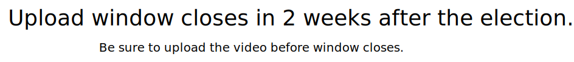

# Uploading Video

The recorded videos from each round is uploaded to [IPFS](https://ipfs.tech/) either via the Eden UI or manually then the hash is submitted to the Eden Smart Contract for future reference. The video thus uploaded will be available in the UI until the next term ( _<mark style="color:blue;">genesis.eden.eoscommunity.org/election/stats</mark>_)  and in theory, forever preserved in IPFS.

<figure><figcaption></figcaption></figure>
